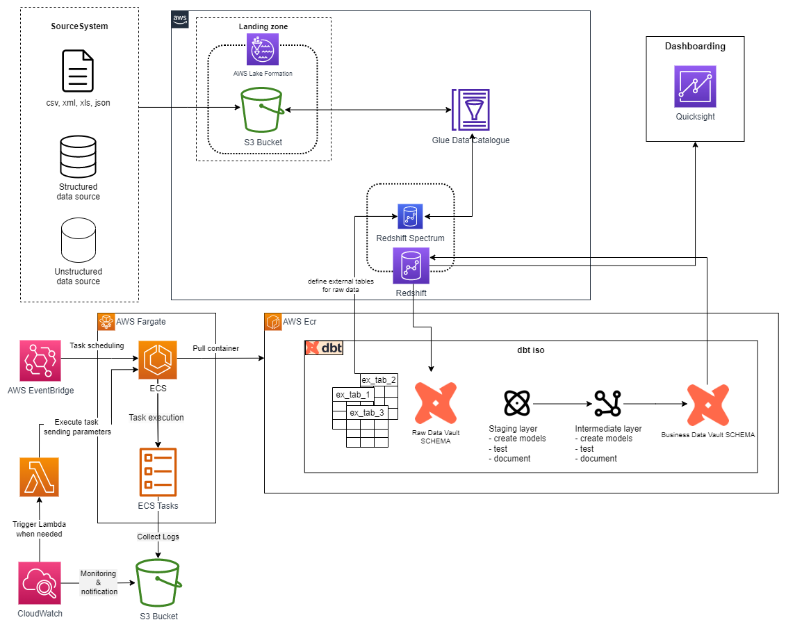
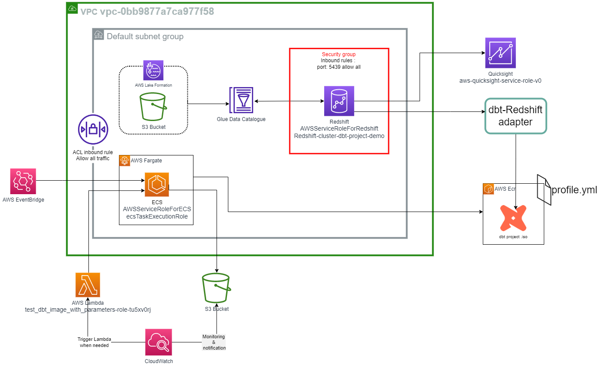

# POC - dbt serverless on aws

## Index:

- [Pipeline architecture](#pipeline-architecture)
- [Network infrastructure and policies](#network-infrastructure-and-policies)
- [Set up the project](#set-up-the-project)
- [Implementation](#implementation)
- [AWS services and costs ](#aws-services-and-costs)
- [Resources](#resources)

------------------------------------------------------
## Pipeline architecture


The above architecture depicts a simple ELT pipeline in which raw data are loaded directly from sources into an S3 bucket. These raw data are then used to populate external tables in the *Redshift* data warehouse, which serve as the source tables for our dbt project. All the transformation phases, including testing and documentation, are managed by *dbt*. We have implemented a serverless version of dbt using a dbt Docker image hosted in *ECR*. We can configure a cron schedule using the *AWS EventBridge* service to run *ECS tasks* that execute any dbt CLI command. Logs from ECS task execution can be monitored using *Cloudwatch*, and *Lambda functions* can be used to respond to any potential failures.

Once the data has been transformed and cleaned, it is ready to be displayed in *Quicksight*.

------------------------------------------------------

## Network infrastructure and policies 


The above schema depicts the AWS VPC and all the internal subnets, security groups, and ACLs involved in the pipeline, including all the roles assumed by each service to operate within it.

-------------------------------------------------------

## Set up the project
- [Set up AWS](#set-up-aws)
- [Set up dbt](#set-up-dbt)

### Set up AWS
Before running dbt models we need to set-up the AWS environment
- Restart the Redshift cluster **redshift-cluster-dbt-project-demo**
- Schedule ECS Tasks (needed  only for dbt serverless)

### Set up dbt
Prerequisite of the system : 
    requires Python and git to successfully install and run dbt Core. 
    Install Git and Python version 3.7 or higher.

- Clone the git-ub repository : https://github.com/fermic98/dbt-aws-project on VScode
- to locally run dbt, update the *profile.yml* file inside the **.dbt** folder. To do so copy and   paste the content of [profile.yml](/profiles.yml) of this repo in your local file.

Now is it possible to execute from the terminal all dbt cli commands
- dbt deps
- dbt run
- dbt test

-------------------------------------------------------

## Implementation
### dbt with Redshift
**The sources** have not been implemented, instead data have been manually loaded in the s3 bucket as .txt files for semplicity.

The Raw data are collected in the s3 istances. 
From here there is a first important step to follow in orther to populate the Redshift datawarehouse.
The technique used leverages external tables. They are a feature that allows you to query and join data stored in external data sources directly from your Redshift cluster without having to load the data into the cluster's storage. Instead, the data remains in its original location, such as Amazon S3, and Redshift treats it as an external table.

In Redshift text editor and query runner the following instruction has been written and run:
```sql
create external schema tickit_external
from data catalog
database 'tickit_dbt'
iam_role 'arn:aws:iam::<your_aws_acccount_id>:role/ClusterPermissionsRole'
create external database if not exists;
```
What is done with this command is to create a new schema in the Glue data Catalogue called "tickit-external". This schema will be the place where to store all meta data of our external tables.

To build external tables now, it is needed to operate on the dbt project.
The tickit__sources.yml file in the models/staging/tickit/external-tables/ model’s subdirectory defines the schema and S3 location for each of the seven external TICKIT database tables: category, date, event, listing, sale, user, and venue.
```sql
version: 2

sources:
  – name: tickit_external
    description: Sales activity for the fictional TICKIT web site, where users buy and sell tickets online for sporting events, shows, and concerts.
    database: demo
    schema: tickit_external
    loader: s3
    tables:
      – name: category
        description: dimension table – TICKIT categories
        external:
          location: "s3://<your_s3_bucket_name>/raw_tickit_data/category/"
          row_format: >
            serde 'org.apache.hadoop.hive.serde2.OpenCSVSerde'
            with serdeproperties (
                'separatorChar'='|'
            )
          table_properties: "('skip.header.line.count'='1')"
        columns:
          – name: catid
            data_type: int
            description: primary key
            tests:
              – unique
              – not_null
          – name: catgroup
            data_type: varchar(20)
          – name: catname
            data_type: varchar(20)
          – name: catdesc
            data_type: varchar(50)
```

 To create the seven external tables in the AWS Glue Data Catalog it was executed the command
 ```
dbt run-operation stage_external_sources
```
This command is part of the dbt-external-tables package we included in the project. It iterates through all source nodes, creates the tables if missing, and refreshes metadata.

 Focus must be paid to "schema" field which is the one previously created and to the field "location". This package will look for the table name inside the AWS Glue Data Catalogue schema and if not present it will generate all the metadata defined in the tickit--sources.yml file.

At this point our Datawarehouse is configured to access our data source by means of the external tables. So it is possible to create whatever models needed for Data analysis.

Once we execute the dbt run command, all the models are created in Redshift respecting the dependency order shown in the autogenerated DAG.

### dbt serverless
After we have configured the communication between dbt and Redshift, we have built a Docker image of the dbt project and loaded the container in ECR.
```
FROM python:3.9

# Set the working directory inside the container
WORKDIR /app

# Copy the dbt project files to the container
COPY . /app

# Install dependencies
RUN pip install dbt

# Set the entrypoint command to run dbt with the profiles.yml file as a parameter
ENTRYPOINT ["dbt", "run", "-m", "/root/.dbt/profiles.yml"]
```
We specify the path of the profile.yml inside the dbt project so that the compiler in dbt knows how to contact the Redshift datawarehouse.

**WARNING :** In the Docker image the dbt project folder contains the profiles.yml file that should be encrypted and secured within AWS ECR.

We can now define ECS tasks to run within AWS Fargate our container instance with a command that can be easily defined during task definition.

To react to any potential failures, it is possible to run Lambda functions setting both the command to be executed and environmental variables of the ECS Tasks.
The following is an exmaple of the Lambda functions used : 
```python
import boto3

def lambda_handler(event, context):
    # Define the ECS client
    ecs = boto3.client('ecs')

    # Define the parameters dictionary
    parameters = {
        "taskDefinition": "arn:aws:ecs:eu-west-1:999017169478:task-definition/dbt-models-building:2",
        "cluster": "arn:aws:ecs:eu-west-1:999017169478:cluster/dbt-project-cluster",
        "launchType": "FARGATE",
        "networkConfiguration": {
            "awsvpcConfiguration": {
              "subnets": ["subnet-07cb35768e2859c85", "subnet-0798c47d1a21868fc"],
              "securityGroups": ["sg-01bf05f38ffab1805"],
              "assignPublicIp": "ENABLED"
             }
        },
        "overrides": {
            "containerOverrides": [
                {
                    "name": "dbt-aws-project", 
                    "command": ["dbt", "run", "--select", "fct_sales", "--profile-dir", "."],
                    "environment": [
                        {
                            "name1": "variable",
                            "value1": "value"
                        },
                        {
                            "name2": "variable",
                            "value2": "value"
                        }
                    ] 
                }
            ]
        }
    }

    # Run the task in the cluster
    response = ecs.run_task(**parameters)
```

-------------------------------------------------------
## AWS services and costs 
### PAYING
 - Redshift : 7,20 euro al giorno per I dati presenti sul Tickit databases

### FREE TIER : 

 - S3 bucket : New clients receive 5GB os storage in S3 Standard, 20.000 GET, 2.000
               PUT, COPY, POST, or LIST requests per month
 - AWS Gule Data Catalogue : first million of memorized object is free
 - Quicksight : Used the first month free for new users
 - Cloudwatch 
 - Lambda 
 - EventBridge 
 - ECS 
 - ECR 

## Resources
- Configure a dbt project to run on Redshift [article on Programmatic Ponderings blog](https://programmaticponderings.com/2022/08/19/lakehouse-data-modeling-using-dbt-amazon-redshift-redshift-spectrum-and-aws-glue/) --> Sacro Graal
- [dbt docs](https://docs.getdbt.com/docs/introduction)
- [aws docs](https://docs.aws.amazon.com/)
- Documentazione dbt : 
    - dbt docs generate
    - dbt docs serve
